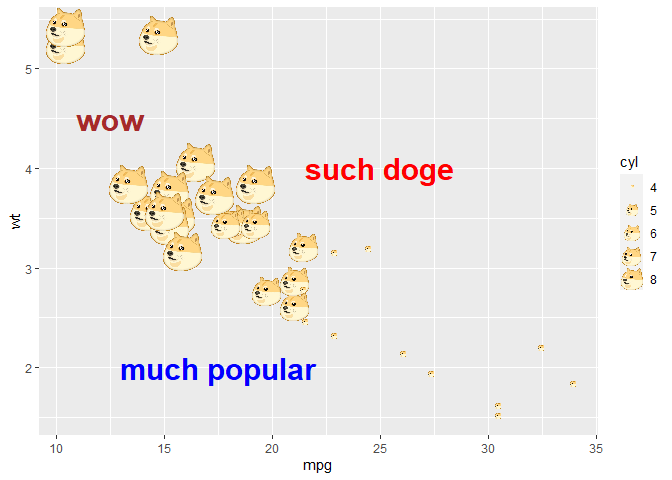

<!-- README.md is generated from README.Rmd. Please edit that file -->

# dogeR 

<!-- badges: start -->


<!-- badges: end -->

Doge for your ggplots

## Installation

You can install the released version of dogeR from
[GitHub](https://github.com/mohit2152sharma/dogeR) with:

``` r
remotes::install_github("dogeR")
```

## Example

This is a basic example which shows you how to solve a common problem:

``` r
library(dogeR)
library(ggplot2)

ggplot(mtcars) + 
  geom_doge(aes(mpg, wt, size=cyl)) +
  annotate(geom='text', x=25, y=4, label='such doge', color='red', size=8, fontface='bold') +
  annotate(geom='text', x=12.5, y=4.5, label='wow', color='brown', size=8, fontface='bold') +
  annotate(geom='text', x=17.5, y=2, label='much popular', color='blue', size=8, fontface='bold')
```



## Acknowledgements

-   [coolbutuseless/geomlime](https://github.com/coolbutuseless/geomlime)
-   Tidyverse team for maintaining and developing `ggplot2`
-   [doge-image](https://www.pngaaa.com/detail/34415)
